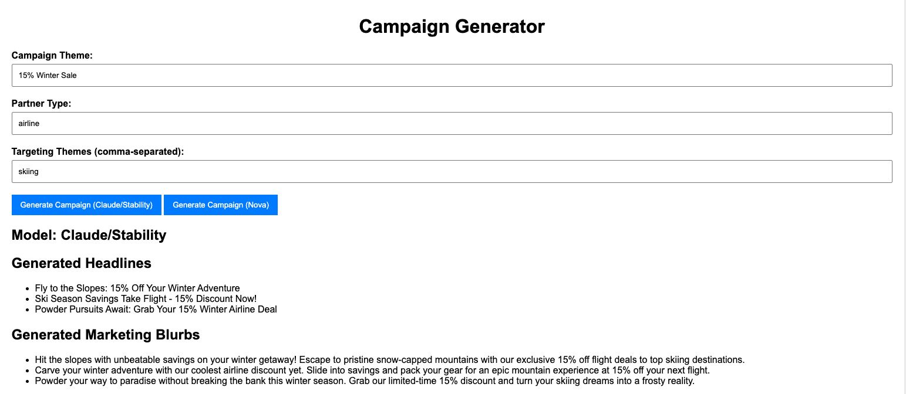
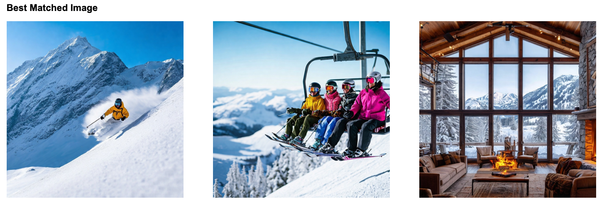
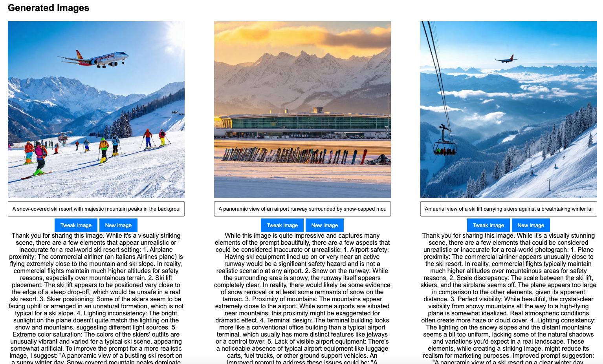

# AI Generated Marketing Content 

This sample code is used to generated marketing headlines, text content and images to support a marketing campaign. 

It creates a Flask based web application where a user can enter some themes, campaign and target group information.

It will then generate some marketing headlines and text. It will also select the best image from an existing image catalog and create a brand new image. 
The user can also tweak created images. The generated images are also fed back into the model for analysis to determine how realistic they are and make suggestions for a better prompt. 

## Installation
Sample existing images are provided in the imagecatalog folder. You can add your own png/jpeg files to this directory. 

Then run 

python catalogimages.py 

To generate descriptions of each image which are stored in a JSON file - imagecatalog.json. Future improvements would incorporate a vector embedding and search rather than a simple JSON description file.

You need to have flask, PIL, pandas and boto3 installed to run.

python app.py

Navigate to localhost:5001 to view the interface.

